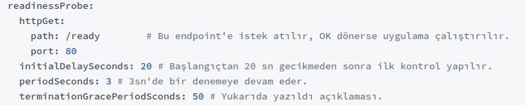

## Liveness Probes
- Bazen container’ların içerisinde çalışan uygulamalar, tam anlamıyla doğru çalışmayabilir. Çalışan uygulama çökmemiş, kapanmamış ama aynı zamanda tam işlevini yerine getirmiyorsa kubelet bunu tespit edemiyor.
- Liveness, sayesinde container’a bir request göndererek, TCP connection açarak veya container içerisinde bir komut çalıştırarak doğru çalışıp çalışmadığını anlayabiliriz.
- Liveness probe ile uygulamamizin hatasiz calisip calismadigini ogrenebiliriz.

```bash
mkdir liveness
cd liveness
```

- Create `liveness-http.yaml` and copy the followings.
```bash
apiVersion: v1
kind: Pod
metadata:
  labels:
    test: liveness
  name: liveness-http
spec:
  containers:
  - name: liveness
    image: k8s.gcr.io/liveness
    args:
    - /server
    livenessProbe:
      httpGet:
        path: /healthz
        port: 8080
        httpHeaders:
        - name: Custom-Header
          value: Awesome
      initialDelaySeconds: 3
      periodSeconds: 3
```
- aciklamasi
```bash
# http get request gönderelim.
# eğer 200 ve üzeri cevap dönerse başarılı!
# dönmezse kubelet container'ı yeniden başlatacak.
apiVersion: v1
kind: Pod
metadata:
  labels:
    test: liveness
  name: liveness-http
spec:
  containers:
  - name: liveness
    image: k8s.gcr.io/liveness
    args:
    - /server
    livenessProbe:
      httpGet:	# get request'i gönderiyoruz.
        path: /healthz # path tanımı
        port: 8080 # port tanımı
        httpHeaders: # get request'imize header eklemek istersek
        - name: Custom-Header
          value: Awesome
      initialDelaySeconds: 3 # uygulama hemen ayağa kalkmayabilir,
      											 # çalıştıktan x sn sonra isteği gönder.
      periodSeconds: 3 # kaç sn'de bir bu istek gönderilecek. 
      								 # (healthcheck test sürekli yapılır.)
---
# uygulama içerisinde komut çalıştıralım.
# eğer exit -1 sonucu alınırsa container baştan başlatılır.
apiVersion: v1
kind: Pod
metadata:
  labels:
    test: liveness
  name: liveness-exec
spec:
  containers:
  - name: liveness
    image: k8s.gcr.io/busybox
    args:
    - /bin/sh
    - -c
    - touch /tmp/healthy; sleep 30; rm -rf /tmp/healthy; sleep 600
    livenessProbe:
      exec:  			# komut çalıştırılır.
        command:
        - cat
        - /tmp/healthy
      initialDelaySeconds: 5
      periodSeconds: 5
---
# tcp connection yaratalım. Eğer başarılıysa devam eder, yoksa 
# container baştan başlatılır.
apiVersion: v1
kind: Pod
metadata:
  name: goproxy
  labels:
    app: goproxy
spec:
  containers:
  - name: goproxy
    image: k8s.gcr.io/goproxy:0.1
    ports:
    - containerPort: 8080
    livenessProbe:	# tcp connection yaratılır.
      tcpSocket:
        port: 8080
      initialDelaySeconds: 15
      periodSeconds: 20
```

- Create and copy the following. `liveness-exec.yaml`
```bash
apiVersion: v1
kind: Pod
metadata:
  labels:
    test: liveness
  name: liveness-exec
spec:
  containers:
  - name: liveness
    image: k8s.gcr.io/busybox
    args:
    - /bin/sh
    - -c
    - touch /tmp/healthy; sleep 30; rm -rf /tmp/healthy; sleep 600
    livenessProbe:
      exec:
        command:
        - cat
        - /tmp/healthy
      initialDelaySeconds: 5
      periodSeconds: 5
```

- Create `goproxy.yaml` and the following.
```bash
apiVersion: v1
kind: Pod
metadata:
  name: goproxy
  labels:
    app: goproxy
spec:
  containers:
  - name: goproxy
    image: k8s.gcr.io/goproxy:0.1
    ports:
    - containerPort: 8080
    livenessProbe:
      tcpSocket:
        port: 8080
      initialDelaySeconds: 15
      periodSeconds: 20
```
- Oncelikle 2. bir terminal ac ve `kubectl get pods -w` komutunu gir.
- Ilk terminalden bu yaml dosyalarini calistirin.

```bash
kubectl applyy -f .
```
- 2. terminalden `restart kismina` bak container calismadigi icin yeni container olusturuyor.

- Bunu baska sekilde gormek icin
```bash
kubectl describe pod liveness-http
``` 
    - Events kisminda gosteriliyor.

- `CrashLoopBackOff` kubernetes bize git bu containera bak bir sikinti var diye uyariyor.

## Readiness Probess
- 3 podumuz ve 1 LoadBalancer service’imiz var. Bir güncelleme yaptık; yeni bir image oluşturduk. Eski podlar devreden çıktı, yenileri alındı. Yenileri alındığından itibaren LoadBalancer gelen trafiği yönlendirmeye başlayacaktır. Peki, benim uygulamalarım ilk açıldığında bir yere bağlanıp bir data çekip, bunu işliyor ve sonra çalışmaya başlıyorsa? Bu süre zarfında gelen requestler doğru cevaplanamayacaktır. Kısacası, uygulamamız çalışıyor ama hizmet sunmaya hazır değil.

- Kubelet, bir containerın ne zaman trafiği kabul etmeye (Initial status) hazır olduğunu bilmek için Readiness Probes kullanır. Bir Poddaki tüm container’lar Readiness Probes kontrolünden onay alırsa Service Pod’un arkasına eklenir.
Yukarıdaki örnekte, yeni image’lar oluşturulurken eski Pod’lar hemen terminate edilmez. Çünkü, içerisinde daha önceden alınmış istekler ve bu istekleri işlemek için yürütülen işlemler olabilir. Bu sebeple, k8s önce bu Pod’un service ile ilişkisini keser ve yeni istekler almasını engeller. İçerideki mevcut isteklerinde sonlanmasını bekler.
- `terminationGracePeriodSconds: 30` –> Mevcut işlemler biter, 30 sn bekler ve kapanır. (30sn default ayardır, gayet yeterlidir.)

- Readiness ile Liveness arasındaki fark, Readiness ilk çalışma anını baz alırken, Liveness sürekli çalışıp çalışmadığını kontrol eder.
Örneğin; Backend’in ilk açılışta MongoDB’ye bağlanması için geçen bir süre vardır. MongoDB bağlantısı sağlandıktan sonraPod’un arkasına Service eklenmesi mantıklıdır. Bu sebeple, burada readiness’i kullanabiliriz.
Aynı Liveness’ta olduğu gibi 3 farklı yöntem vardır:
http/get, tcp connection ve command çalıştırma.

```bash
mkdir readiness
cd readiness
```

- Create `ready1.yaml` and `ready2.yaml` then copy the followings.
```bash
apiVersion: apps/v1
kind: Deployment
metadata:
  name: frontend
  labels:
    team: development
spec:
  replicas: 3
  selector:
    matchLabels:
      app: frontend
  template:
    metadata:
      labels:
        app: frontend
    spec:
      containers:
      - name: frontend
        image: ozgurozturknet/k8s:blue
        ports:
        - containerPort: 80
        livenessProbe:
          httpGet:
            path: /healthcheck
            port: 80
          initialDelaySeconds: 5
          periodSeconds: 5
        readinessProbe:
          httpGet:
            path: /ready
            port: 80
          initialDelaySeconds: 20
          periodSeconds: 3
---
apiVersion: v1
kind: Service
metadata:
  name: frontend
spec:
  selector:
    app: frontend
  ports:
    - protocol: TCP
      port: 80
      targetPort: 80
```

- Code aciklamasi 


- 2 ayri terminal ac.
```bash
kubectl get pods -w
watch kubectl describe endpoints frontend 
```
- yaml file calistir.
```sh
kubectl apply -f .
```
- simulasyon icin fronted podlarinin bir tanesini icine gir. ve ready klasorunu sil
```bash
kubectl exec frontend-8d4ccd64d-wfg8l -- rm -rf ready
```

- Container ready 0/1 oldu tekrar `ready` olusturursam 1/1 olacak 
```bash
kubectl exec frontend-8d4ccd64d-wfg8l -- touch ready
```
